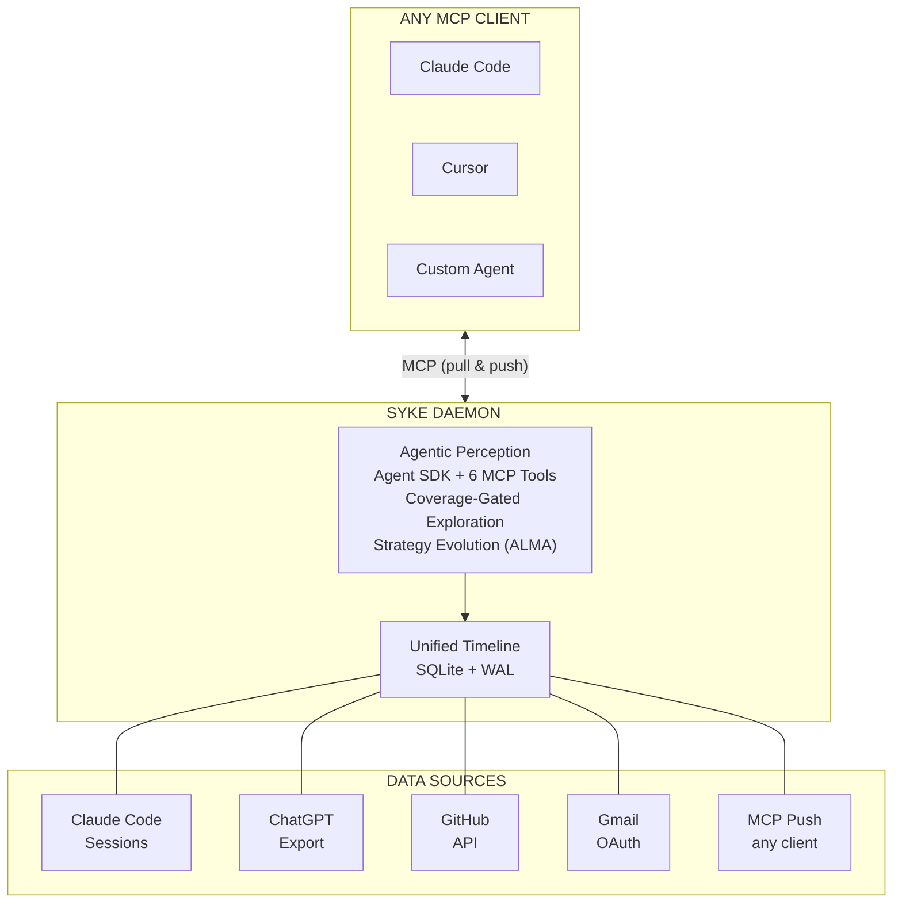

# Syke — Agentic Memory

[](https://opensource.org/licenses/MIT)
[](https://www.python.org/downloads/)
[](https://github.com/saxenauts/syke/actions)
[](https://www.anthropic.com)
[](https://modelcontextprotocol.io)
[](https://syke-ai.vercel.app)
[](https://syke-docs.vercel.app)

**[→ Docs](https://syke-docs.vercel.app)** · **[→ Demo](https://syke-ai.vercel.app)** · **[→ PyPI](https://pypi.org/project/syke/)**

[](https://youtu.be/56oDe8uPJB4)

> Agentic working memory for the AI-native stack. Your digital footprint — code, conversations, commits, emails — synthesized into a living, self-evolving model. Daemon-synced. Every AI tool you use, knows you.

## The Problem

Every AI session starts from zero. *"Hi, I'm an AI assistant. How can I help?"*

Your context is scattered across platforms. Your commits, your ChatGPT threads, your email — each tool sees a slice. None see you.

Syke fixes this. Not by storing facts. By synthesizing who you are.

## What You Get

A living model of you, available to every AI tool. Here's what a real Syke profile looks like:

```
# About alex
<!-- Generated by Syke from gmail, chatgpt, github (150 events) -->

A curious builder exploring the intersection of AI and developer tools.

## What's Active Right Now
🔥 **Syke Hackathon**: Building a personal context daemon for Claude Code hackathon.
  - Multiple commits today
  - ChatGPT conversations about architecture

## Recent Context
Working intensely on Syke, a personal context daemon. Writing Python, using Opus 4.6.

## Current World State
Building Syke v0.2 for Claude Code Hackathon (deadline Feb 16). Core focus: ask() tool.

## How They Communicate
casual, intense, exploratory. Direct, fast-paced, mixes technical and philosophical.
```

## How It Works



**The loop**: Collect signals from your platforms → synthesize patterns across them → distribute to every AI tool → collect new signals back → re-synthesize. Every 15 minutes. Your model drifts with you.

## Quick Start

```bash
uvx syke setup --yes
```

`ANTHROPIC_API_KEY` recommended for profile generation ([get one here](https://console.anthropic.com/settings/keys)). Setup works without it — data collection, MCP, and daemon proceed; perception is skipped until the key is added.

Auto-detects your username, local data sources, builds your identity profile, and configures MCP.

<details>
<summary>Other install methods</summary>

**pipx** (persistent install):
```bash
pipx install syke
syke setup --yes
```

**pip** (in a venv):
```bash
pip install syke
syke setup --yes
```
</details>

<details>
<summary>From source (development)</summary>

```bash
git clone https://github.com/saxenauts/syke.git && cd syke
python3 -m venv .venv && source .venv/bin/activate
pip install -e .
cp .env.example .env  # Set ANTHROPIC_API_KEY
python -m syke setup --yes
```
</details>

<details>
<summary>API key setup</summary>

Get your key from [console.anthropic.com](https://console.anthropic.com/settings/keys). Required for perception and the `ask()` MCP tool.

```bash
export ANTHROPIC_API_KEY=your-key-here
echo 'export ANTHROPIC_API_KEY=your-key-here' >> ~/.zshrc  # persist
```
</details>

## How Syke Thinks

This is where Syke pushes the boundaries of what's possible with the Agent SDK.

### Agent SDK with Custom MCP Tools

The perception agent doesn't receive a text dump — it *explores* interactively. Six custom MCP tools let it browse timelines, search across platforms, cross-reference topics, read its own prior profiles, and submit structured output:

| Tool | Purpose |
|------|---------|
| `get_source_overview` | Understand what data exists: platforms, counts, date ranges |
| `browse_timeline` | Browse events chronologically with source/date filters |
| `search_footprint` | Full-text keyword search across all events |
| `cross_reference` | Search a topic across ALL platforms, grouped by source |
| `read_previous_profile` | Read prior perception for incremental updates |
| `submit_profile` | Submit the final structured profile (gated by coverage) |

The agent typically makes 5-12 targeted tool calls, forming hypotheses and testing them — not processing a static context window.

### Coverage-Gated Exploration (PermissionResultDeny)

The Agent SDK's hook system enforces exploration quality. A `PreToolUse` hook tracks which sources the agent has browsed, searched, and cross-referenced. If the agent tries to call `submit_profile` before covering all platforms:

```
PermissionResultDeny(reason="Sources not explored: github (67% coverage).
Explore the missing sources first, then resubmit.")
```

The agent literally cannot submit a shallow profile. Zero extra API cost — hooks piggyback on existing turns.

### Multi-Agent Orchestration

Three specialized Sonnet sub-agents explore in parallel, each with constrained tool access:

- **Timeline Explorer** — browses chronologically, identifies active threads and recent patterns
- **Pattern Detective** — cross-references topics across platforms, finds contradictions
- **Voice Analyst** — analyzes communication style, tone, vocabulary, personality signals

Opus synthesizes their findings into the final profile. Agent SDK's `AgentDefinition` handles delegation, tool scoping, and result aggregation.

### ALMA-Inspired Strategy Evolution

**This is the technical crown jewel.** Inspired by the ALMA paper (Clune, 2026) — the agent evolves its own exploration strategy across runs:

1. **Explore**: Agent runs perception, leaving a trace of every tool call and result
2. **Reflect**: Deterministic analysis labels each search as productive or wasted (zero LLM cost)
3. **Evolve**: Productive queries promoted, dead ends culled, new priorities discovered
4. **Adapt**: Next run reads the evolved strategy via tool, explores smarter

**12 runs. Real data. The system learned.**

| Strategy | Runs | Key Searches | Peak Score |
|----------|------|-------------|------------|
| v0 (baseline) | 1-3 | project names: Syke, Pogu, ALMA | 88.7% |
| v1 (concepts) | 4-6 | concepts: memory, federated, PersonaMem | **94.3%** |
| v2 (entities) | 7-9 | entities: wizard, Persona, Eder | 91.2% |
| v3 (refined) | 10-12 | refined ranking, entity relationships | 92.8% |

**Key discovery**: searching for *concepts* beats searching for *project names*. Strategy v1 found deeper cross-platform connections because "memory" appears across ChatGPT research, Claude Code implementation, and GitHub commits — while "Syke" only appears where the project is explicitly named.

Total cost: $8.07 across 12 runs. Peak quality: 94.3% at $0.60/run — 67% cheaper than the $1.80 legacy baseline.

### Federated Push/Pull

Any MCP client can *read* your context (pull) and *contribute* new events back (push). Your Claude Code session logs what you're building. Your Cursor session adds context. The identity grows from every tool.

### Continuous Sync

The daemon syncs every 15 minutes, runs incremental profile updates, and skips when nothing changed. Identity that drifts with you — what's true about you on Monday isn't true on Friday.

### Memory Threading

Active threads track what you're working on *across* platforms. A GitHub commit about "auth refactor" + a ChatGPT research thread on "JWT vs session tokens" + a Claude Code session implementing the change = one coherent thread with cross-platform signals.

```json
{
  "name": "Syke Hackathon",
  "intensity": "high",
  "platforms": ["github", "chatgpt"],
  "recent_signals": [
    "Multiple commits today",
    "ChatGPT conversations about architecture"
  ]
}
```

The perception agent discovers these connections by cross-referencing topics across all platforms — it's not hard-coded.

## MCP Server

8 tools via the Model Context Protocol. The `ask()` tool is the recommended entry point — ask anything about the user in natural language and Syke explores the timeline to answer. Core data tools (zero cost, no API key): `get_profile`, `query_timeline`, `search_events`, `get_manifest`, `push_event`, `push_events`.

## Benchmarks

All methods produce the same `UserProfile` schema. Tested on 3,225 events across ChatGPT, Claude Code, and GitHub:

| | Legacy | Agentic v1 | Multi-Agent v2 | Meta-Best |
|---|-------:|----------:|---------------:|---:|
| **Cost** | $1.80 | $0.71 | $1.04 | **$0.60** |
| **Eval score** | -- | -- | -- | **94.3%** |
| Source coverage | 100% | 67% | 100% | 100%* |
| Cross-platform threads | 2 | 1 | 2 | 4 |
| Identity anchor | 660ch | 411ch | 637ch | 819ch |
| Wall time | 119s | 160s | 225s | 189s |
| API turns | 1 | 13 | 13 | 12 |

**Meta-Best Per-Dimension Breakdown (Run 5):**

| Dimension | Score | Detail |
|-----------|------:|--------|
| Thread quality | 61% | 6 threads, 4 cross-platform, high specificity |
| Identity anchor | 78% | 819 chars, deep and specific |
| Voice patterns | 100% | Rich tone, 5 vocab notes, 6 examples |
| Source coverage | 100% | 3/3 platforms |
| Completeness | 100% | All fields populated |
| Recent detail | 100% | 1,304 chars, 10 temporal markers |
| **Composite** | **94.3%** | Weighted average |

## Architecture

### Why SQLite over vector DB?

Syke doesn't need semantic search at the storage layer — that's the LLM's job during perception. SQLite with WAL mode gives concurrent reads, ACID transactions, zero infrastructure. Semantic understanding happens in Opus's thinking, not in the database.

### Why Agent SDK over raw API calls?

Hooks (`PreToolUse`, `PostToolUse`), sub-agent delegation, and structured tool definitions. The coverage gate would require building a custom orchestration loop from scratch. With the SDK, it's a single `PermissionResultDeny` return.

### Why one event per session?

Sessions are the natural unit of intent. A Claude Code session about "refactoring auth" has 50+ messages but represents one activity. Per-message would bloat the timeline 50x.

### Why content filtering?

Privacy by design, not afterthought. Credentials and private messages never enter the timeline. Content that never enters SQLite can never be sent to an LLM.

### Why 4 output formats?

Different consumers: JSON for programs, Markdown for humans, CLAUDE.md for Claude Code projects, USER.md for portable identity.

## Privacy

**Local storage**: All data stays in `~/.syke/data/{user}/syke.db`. Nothing is uploaded except during perception (Anthropic API, under their [data policy](https://www.anthropic.com/privacy)).

**Content filtering**: Pre-collection filter strips credentials and private messaging content before events enter SQLite.

**Consent tiers**: Public sources (GitHub) need no consent. Private sources (Claude Code, ChatGPT, Gmail) require `--yes` flag.

## Supported Platforms

| Platform | Status | Method | Data Captured |
|----------|--------|--------|---------------|
| Claude Code | Working | Local JSONL parsing | Sessions, tools, projects, git branches |
| ChatGPT | Working | ZIP export parsing | Conversations, topics, timestamps |
| GitHub | Working | REST API | Repos, commits, issues, PRs, stars, READMEs |
| Gmail | Working | OAuth API | Subjects, snippets, labels, sent patterns |
| Twitter/X | Stub | -- | Adapter stubbed, not implemented |
| YouTube | Stub | -- | Adapter stubbed, not implemented |

---

[Docs](https://syke-docs.vercel.app) · [Demo](https://syke-ai.vercel.app) · [PyPI](https://pypi.org/project/syke/) · 297 tests · MIT · By [Utkarsh Saxena](https://github.com/saxenauts)
