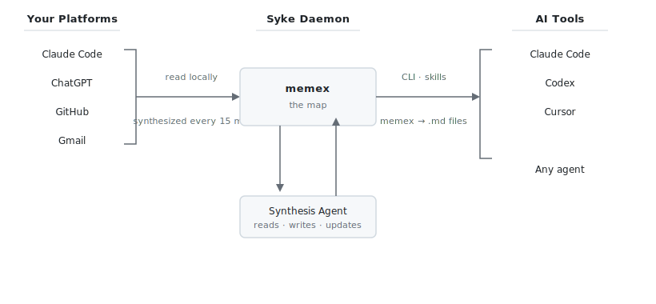

# Syke

[](https://pypi.org/project/syke/)
[](https://www.python.org/downloads/)
[](https://github.com/saxenauts/syke)
[](https://opensource.org/licenses/MIT)

Agentic memory for your AI tools. A background daemon watches your platforms — code, conversations, commits, emails — synthesizes them into a living model of who you are, and serves it to every AI session automatically.

## Quick Start

```bash
pipx install syke
syke setup --yes
```

That's it. Setup detects your data sources, ingests them, and starts the background daemon. Synthesis runs automatically on the daemon's first tick — no waiting.

<details>
<summary>Other install methods</summary>

**uv tool install** (if you use uv):
```bash
uv tool install syke
syke setup --yes
```

**From source** (for development):
```bash
git clone https://github.com/saxenauts/syke.git && cd syke
python3 -m venv .venv && source .venv/bin/activate
pip install -e .
syke setup --yes
```
</details>

## Auth

Syke supports multiple LLM providers. Setup shows a picker — choose whichever you have:

**Anthropic-native providers:**
```bash
syke auth use codex             # ChatGPT Plus via Codex (reads ~/.codex/auth.json)
syke auth set openrouter --api-key YOUR_KEY  # OpenRouter
syke auth set zai --api-key YOUR_KEY         # z.ai
syke auth set kimi --api-key YOUR_KEY        # Kimi
```

**OpenAI-compatible providers** (via LiteLLM — included with syke):
```bash
syke auth set azure --api-key sk-xxx --endpoint https://my-deploy.openai.azure.com --model gpt-4o
syke auth set azure-ai --api-key sk-xxx --base-url https://my-project.services.ai.azure.com/models --model Kimi-K2.5
syke auth set openai --api-key sk-xxx --model gpt-4o
syke auth set ollama --model llama3.2                    # no API key needed
syke auth set vllm --base-url http://localhost:8000 --model mistral-7b
syke auth set llama-cpp --base-url http://localhost:8080 --model llama3.2
```

Providers that speak OpenAI format (Azure, Azure AI Foundry, OpenAI, ollama, vLLM, llama.cpp) use LiteLLM for automatic Anthropic-to-OpenAI translation. LiteLLM is included with Syke — no extra install needed.

Claude Code session auth (`claude login`) is auto-detected if available, but is not the default — you pick your provider during setup.

**Provider resolution**: CLI `--provider` flag > `SYKE_PROVIDER` env var > `~/.syke/auth.json` active_provider > auto-detect.

Switch providers: `syke auth use codex`, `SYKE_PROVIDER=openrouter syke ask "question"`, or `syke --provider codex ask "question"`

Check status: `syke doctor` shows active provider and credentials.

## What It Does

Every AI session starts from zero. Your context is scattered — commits in GitHub, threads in ChatGPT, sessions in Claude Code, emails in Gmail. Each tool sees a slice. None see you.

Syke fixes this. A background daemon syncs your platforms every 15 minutes, an AI agent synthesizes what it finds into memories, and the result — a self-evolving map of who you are, the memex — is distributed to your AI tools automatically.

**The output — your memex:**

```markdown
# Memex — dev

## Identity
Full-stack engineer building AI developer tools. Python, TypeScript, React.

## What's Active
- **Syke v0.4.5** [high] (github, claude-code, codex): Multi-provider auth,
  config TOML defaults, daemon-first synthesis flow. 293 tests.
- **Client project** [medium] (gmail, github): API integration due Friday.

## Context
Deep in release mode. Communication style: direct, fast-paced, technical.
Prefers concise answers. Working late nights this week.

## Recent Context
Shipping v0.4.5 with provider picker setup, codex/gmail ingestion polish,
and config commands. Providers: claude-login, codex, openrouter, zai, kimi.

---
Sources: claude-code, github, chatgpt, codex, gmail. Events: 6000+.
```

This is what your AI tools see at the start of every session — instant context, no "tell me about yourself."

## CLI Commands

```bash
syke ask "question"   # Ask anything about yourself
syke auth status      # Auth provider + credential status
syke config show      # Show effective config (defaults + config.toml)
syke context          # Dump current memex to stdout
syke doctor           # Verify auth, daemon, DB health, provider status
syke record "note"    # Push an observation into memory
syke self-update      # Update to latest version
syke setup            # Interactive setup (provider picker + ingest + daemon)
syke status           # One-command daemon + pipeline status
syke sync             # Manual one-time sync
```

That's the agent-facing API. `ask` spawns an AI agent that navigates your memories, follows links, cross-references platforms, and returns a grounded answer. `context` returns the memex instantly (local file read).

## Configuration

Syke uses optional TOML config at `~/.syke/config.toml`. All settings have defaults, so this file is only needed when overriding behavior.

```bash
syke config init      # Create ~/.syke/config.toml with defaults
syke config show      # Print effective config
syke config path      # Print config file path
```

See `docs/CONFIG_REFERENCE.md` for the setting catalog.

## How It Works

<picture>
  <source media="(prefers-color-scheme: dark)" srcset="docs/architecture-dark.svg">
  <source media="(prefers-color-scheme: light)" srcset="docs/architecture-light.svg">
  
</picture>

**The loop**: Collect signals → synthesize memories → update the map → serve to all tools → collect new signals from those tools → re-synthesize. Every 15 minutes.

Internally, the synthesis agent navigates your memory with 15 tools — full read/write access to create, link, update, supersede, and retire knowledge. It decides what's worth remembering. No heuristics, no embeddings — just an LLM reading and writing text.

## Supported Platforms

| Platform | Method | What's Captured |
|----------|--------|-----------------|
| Claude Code | Local JSONL parsing | Sessions, tools, projects, git branches |
| Codex | Local JSON parsing | Sessions, prompts, model/tool usage metadata |
| ChatGPT | ZIP export parsing | Conversations, topics, timestamps |
| GitHub | REST API | Repos, commits, issues, PRs, stars |
| Gmail | OAuth API | Subjects, body text (truncated), labels, sent patterns |

## Daemon Commands

```bash
syke daemon install   # Install daemon service
syke daemon start     # Start background sync (every 15 min)
syke daemon stop      # Stop the daemon
syke daemon status    # Check if running, last sync time
syke daemon uninstall # Remove daemon service
syke sync             # Manual one-time sync
syke self-update      # Update to latest version
```

## Privacy

All data stays local in `~/.syke/data/{user}/syke.db` — one SQLite file per user, copy it anywhere. Nothing leaves your machine except during synthesis (LLM API calls to your configured provider). A pre-collection content filter strips credentials and private messages before events enter the database.

## Learn More

**[Architecture](docs/ARCHITECTURE.md)** — Four-layer memory system, synthesis loop, design decisions (why SQLite over vector DB, why free-form text, why Agent SDK)


**[Memex Evolution](docs/MEMEX_EVOLUTION.md)** — 8-day replay showing how the memex graduates from status page to routing table

**[Setup Guide](docs/SETUP.md)** — Detailed installation, platform configuration, OAuth setup for Gmail

**[Docs Site](https://syke-docs.vercel.app)** — Full reference documentation

**[Demo](https://syke-ai.vercel.app)** — Live visualization of the synthesis process

**[Video walkthrough](https://youtu.be/56oDe8uPJB4)** — 5-minute overview of how Syke works

---

MIT · [Utkarsh Saxena](https://github.com/saxenauts)
