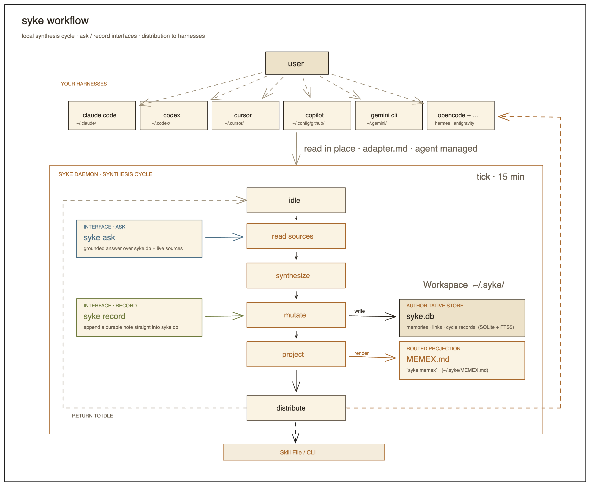

# Syke

[](https://pypi.org/project/syke/)
[](https://python.org)
[](https://github.com/saxenauts/syke/actions/workflows/ci.yml)
[](LICENSE)

Syke is a local memory agent that works with your other AI agents.



It runs in the background as an ambient agent, keeps up with your work
across all harnesses and concurrent sessions and serves a coherent memory for other harnesses to rely on. 

It reads your local agent activity, maintains a coherent timeline of objects, intent, and progress in prose. 
Serves a projection as MEMEX.md, and a CLI interface. 

Your agents use syke ask and syke record and syke memex in their workflow.

As a self evolving agent, it will adapt to your specific workflow and learn patterns to improve its efficiency.

You can also use syke beyond typical memory use cases, like debugging, having syke as a sidekick agent,
for brainstorming and research while you work with your main coding agents.

## Install

```bash
pipx install syke
syke setup
```

Alternative:

```bash
uv tool install syke
syke setup
```

`syke setup` is interactive. It inspects your machine for your active harnesses. Uses Pi agent core for auth and runtime. 

## First Run

The normal flow is simple:

```bash
syke setup
```

Setup walks through:

- provider/auth setup
- local harness detection
- source selection
- workspace initialization at `~/.syke/`
- background daemon setup
- first memory synthesis

After setup, keep working. The first synthesis can take a few minutes depending
on how much local history Syke finds. The timeline explains what is happening
instead of leaving you with an empty screen.

Once memory starts landing:

```bash
syke memex
syke ask "what changed this week?"
```

## Daily Use

```bash
syke memex
syke ask "what should I remember about this project?"
syke record "Decision: keep the onboarding flow interactive and local."
syke status
syke doctor
```

The important split:

- `syke memex` shows the current memory projection.
- `syke ask` searches and reasons over the underlying timeline.
- `syke record` saves an explicit note or decision.
- `syke web --open` shows the local visual timeline.

## Local Timeline

Syke serves a private local timeline. It is for visualization only. 

```bash
syke web --open
```

The timeline shows:

- memory cycles
- asks and traces
- MEMEX content and diffs
- linked memory cells
- first-run/bootstrap state
- daemon log tail

## Supported Harnesses

Syke reads local artifacts from agent tools you already use. Active harnesses
currently include:

- Claude Code
- Codex
- OpenCode
- Cursor
- GitHub Copilot
- Antigravity
- Hermes
- Gemini CLI

See [PLATFORMS.md](PLATFORMS.md) for exact artifact paths and current status.

## How Agents Use Syke

Once setup is done, agents should usually use three commands:

```bash
syke memex
syke ask "what is the current context?"
syke record "Decision: ship the onboarding fix before changing the API."
```

For automation, `syke setup --agent` returns JSON with a `status`, `next_steps`,
and setup diagnostics. Keep that path for installers, CI, and non-interactive
agent runners. Humans should start with plain `syke setup`.

More detail: [Setup Guide](docs/SETUP.md).

## What Syke Stores

Syke is local-machine first.

- Workspace: `~/.syke/`
- Database: `~/.syke/syke.db`
- Current projection: `~/.syke/MEMEX.md`
- Identity/runtime context: `~/.syke/PSYCHE.md`
- Adapter guides: `~/.syke/adapters/{source}.md`
- Pi provider/runtime state: `~/.syke/pi-agent/`

On macOS, ask and synthesis run Pi under a filesystem sandbox when available.
The sandbox grants scoped local reads, Syke workspace writes, temp writes, and
network access for provider calls.

## Docs

- [Setup Guide](docs/SETUP.md)
- [Providers](docs/PROVIDERS.md)
- [Config Reference](docs/CONFIG_REFERENCE.md)
- [Architecture](docs/ARCHITECTURE.md)
- [Docs Index](docs/README.md)
