# Syke — Agentic Memory

[](https://opensource.org/licenses/MIT)
[](https://www.python.org/downloads/)
[](https://github.com/saxenauts/syke/actions)
[](https://www.anthropic.com)
[](https://modelcontextprotocol.io)
[](https://syke-ai.vercel.app)
[](https://syke-docs.vercel.app)

**[→ Docs](https://syke-docs.vercel.app)** · **[→ Demo](https://syke-ai.vercel.app)** · **[→ PyPI](https://pypi.org/project/syke/)**

[](https://youtu.be/56oDe8uPJB4)

> Agentic working memory for the AI-native stack. Your digital footprint — code, conversations, commits, emails — synthesized into a living, self-evolving model. Daemon-synced. Every AI tool you use, knows you.

## The Problem

Every AI session starts from zero. *"Hi, I'm an AI assistant. How can I help?"*

Your context is scattered across platforms. Your commits, your ChatGPT threads, your email — each tool sees a slice. None see you.

Syke fixes this. Not by storing facts. By synthesizing who you are.

## What You Get

A living model of you, available to every AI tool. Here's what a real Syke profile looks like:

```
# About alex
<!-- Generated by Syke from gmail, chatgpt, github (150 events) -->

A curious builder exploring the intersection of AI and developer tools.

## What's Active Right Now
🔥 **Syke Hackathon**: Building a personal context daemon for Claude Code hackathon.
  - Multiple commits today
  - ChatGPT conversations about architecture

## Recent Context
Working intensely on Syke, a personal context daemon. Writing Python, using Sonnet.

## Current World State
Building Syke v0.3.5. Core focus: memory synthesis and the memex.

## How They Communicate
casual, intense, exploratory. Direct, fast-paced, mixes technical and philosophical.
```

## How It Works

```mermaid
graph TB
    subgraph Clients["ANY MCP CLIENT"]
        CC[Claude Code]
        CX[Codex / Kimi]
        CA[Custom Agent]
    end

    subgraph Syke["SYKE DAEMON"]
        MS["Memory Synthesis<br/>Agent SDK + 15 MCP Tools<br/>Orient → Extract & Evolve → Update the Map"]
        TL["Evidence Ledger + Memories<br/>SQLite + WAL + FTS5"]
        MX["Memex<br/>The Map"]
        MS --> TL
        MS --> MX
    end

    subgraph Sources["DATA SOURCES"]
        S1[Claude Code<br/>Sessions]
        S2[ChatGPT<br/>Export]
        S3[GitHub<br/>API]
        S4[Gmail<br/>OAuth]
        S5[MCP Push<br/>any client]
    end

    Clients <-->|"MCP (pull & push)"| Syke
    TL --- S1
    TL --- S2
    TL --- S3
    TL --- S4
    TL --- S5
```



**The loop**: Collect signals from your platforms → synthesize memories from them → update the map → distribute to every AI tool → collect new signals back → re-synthesize. Every 15 minutes. Your model drifts with you.

## Works on Your Claude Code Subscription

If you have Claude Code Max, Team, or Enterprise, you already have everything you need. Run `claude login` with the Claude Code CLI — no API key required. Memory synthesis and `ask()` work out of the box on macOS, Linux, and Windows.

| Platform / Auth | Data collection | Synthesis & ask() | Daemon |
|-----------------|-----------------|---------------------|--------|
| Claude Code (Max/Team/Enterprise) via `claude login` | ✓ | ✓ (uses Claude Code auth) | ✓ |
| Any platform + `ANTHROPIC_API_KEY` | ✓ | ✓ (billed per-use) | ✓ |
| Codex / Kimi / Gemini CLI / etc. | ✓ | Needs `ANTHROPIC_API_KEY` today | ✓ |
| No auth at all | ✓ | ✗ | ✓ (collects, skips memory updates) |

## Quick Start

```bash
uvx syke setup --yes
```

`ANTHROPIC_API_KEY` or `claude login` (Claude Code Max/Team/Enterprise) enables memory synthesis and `ask()` ([get an API key here](https://console.anthropic.com/settings/keys)). Setup works without either — data collection, MCP, and daemon proceed; synthesis is skipped until auth is configured.

Auto-detects your username, local data sources, builds your identity profile, and configures MCP.

<details>
<summary>Other install methods</summary>

**pipx** (persistent install):
```bash
pipx install syke
syke setup --yes
```

**pip** (in a venv):
```bash
pip install syke
syke setup --yes
```
</details>

<details>
<summary>Update to the latest version</summary>

```bash
syke self-update
```
Detects your install method (pipx, pip, uvx, or source) and runs the right upgrade command. For `uvx`, updates are automatic — no action needed.
</details>

<details>
<summary>From source (development)</summary>

```bash
git clone https://github.com/saxenauts/syke.git && cd syke
python3 -m venv .venv && source .venv/bin/activate
pip install -e .
cp .env.example .env  # Set ANTHROPIC_API_KEY
python -m syke setup --yes
```
</details>

<details>
<summary>Auth setup (API key or claude login)</summary>

**Option A — API key** (pay-per-use, works anywhere):

Get your key from [console.anthropic.com](https://console.anthropic.com/settings/keys).

```bash
export ANTHROPIC_API_KEY=your-key-here
echo 'export ANTHROPIC_API_KEY=your-key-here' >> ~/.zshrc  # persist
```

**Option B — claude login** (Claude Code Max/Team/Enterprise, macOS/Linux/Windows):

```bash
claude login
```

No API key needed. Memory synthesis and `ask()` use your Claude Code subscription.
</details>

## How Syke Thinks

This is where Syke pushes the boundaries of what's possible with the Agent SDK.

### Three Layers, One Map

Syke's memory system treats **everything as language**. No embeddings, no typed relationship taxonomies, no rigid schemas. The LLM reads text, writes text, and navigates text — the same way it processes anything else.

**Layer 1 — Evidence Ledger**: Append-only event store. Immutable, timestamped, source-tagged. Sessions, commits, conversations, emails. Ground truth — everything else is derived.

**Layer 2 — Memories**: Free-form text units of knowledge, written and maintained by the synthesis agent. A memory can be anything: a person, a project, a preference, a decision, a story. 15 tools expose full CRUD to the agent.

**Layer 3 — Memex**: A special memory that acts as the agent's accumulated understanding of this person. Compact, navigational, self-organizing. The agent reads this first, then navigates. It's not a report — it's a map.

### Agent SDK with 15 Memory Tools

The synthesis agent doesn't receive a text dump — it *navigates* interactively. 15 custom MCP tools give it full read/write access to the memory layer:

**Write tools** (synthesis agent builds the map):

| Tool | Purpose |
|------|---------|
| `create_memory` | Persist new knowledge as free-form text |
| `create_link` | Connect two memories with a natural language reason |
| `update_memory` | Edit in place (minor changes, keeps ID) |
| `supersede_memory` | Replace with new version (major changes, keeps history) |
| `deactivate_memory` | Retire obsolete knowledge (stays in ledger) |

**Read tools** (synthesis + ask agents navigate):

| Tool | Purpose |
|------|---------|
| `get_memex` | Read the map — start here, then navigate |
| `search_memories` | BM25 full-text search over the memory layer |
| `search_evidence` | BM25 search over raw events |
| `follow_links` | Traverse linked memories with reasons |
| `get_memory` | Full content by ID |
| `list_active_memories` | Compact index (ID + first line) |
| `get_memory_history` | Walk the supersession chain |
| `get_recent_memories` | Newest memories first |
| `browse_timeline` | Time-windowed events with source filter |
| `cross_reference` | Search a topic across ALL platforms, grouped by source |

### The Synthesis Loop

Runs after new events are ingested (daemon syncs every 15 minutes):

```
STEP 1 — ORIENT:
  Read the memex (the map). Understand what exists.
  Read new events since last synthesis.

STEP 2 — EXTRACT & EVOLVE:
  For each new event, decide:
  a) New knowledge? → create_memory + create_link
  b) Updates existing? → update_memory or supersede_memory
  c) Makes something obsolete? → deactivate_memory
  d) Not worth remembering? → Skip

STEP 3 — UPDATE THE MAP:
  Rewrite the memex with current state: what's active, key entities, temporal signals.
  Memex stays compact — it's a navigational index, not a dump.
```

The agent has full agency over memory decisions. It decides what's worth remembering, how to organize it, when to retire old knowledge. No heuristics — just language.

### Memory Lifecycle

```
soft    → synthesis creates it from new events
active  → reinforced across multiple sessions
solid   → repeatedly confirmed, becomes a key reference in the memex
dormant → user goes quiet → NOTHING HAPPENS
          memory sits in SQLite, still queryable, zero maintenance
          when user returns, everything is where they left it
```

Memories are permanent by default. Decay only runs during synthesis — if there's no synthesis (user is inactive), nothing decays. Zero maintenance cost.

### Federated Push/Pull

Any MCP client can *read* your context (pull) and *contribute* new events back (push). Your Claude Code session logs what you're building. Your Cursor session adds context. The identity grows from every tool.

### Continuous Sync

The daemon syncs every 15 minutes, runs incremental memory updates, and skips when nothing changed. Identity that drifts with you — what's true about you on Monday isn't true on Friday.

The daemon authenticates using the same method as the CLI — if you're authenticated via `claude login`, no additional setup is required for the daemon.

### Cross-Platform Threads

Active threads track what you're working on *across* platforms. A GitHub commit about "auth refactor" + a ChatGPT research thread on "JWT vs session tokens" + a Claude Code session implementing the change = one coherent memory with cross-platform signals. The synthesis agent discovers these connections by cross-referencing topics — it's not hard-coded.

```json
{
  "name": "Syke Hackathon",
  "intensity": "high",
  "platforms": ["github", "chatgpt"],
  "recent_signals": [
    "Multiple commits today",
    "ChatGPT conversations about architecture"
  ]
}
```

## MCP Server

3 tools via the Model Context Protocol. **Start here**: `get_live_context` returns the memex — the synthesized map of who this person is — often all an agent needs. **Go deeper**: `ask()` explores the memory layer to answer any question about the user in natural language (requires `ANTHROPIC_API_KEY` or `claude login`). **Contribute back**: `record()` pushes observations from your session into the user's timeline.

## Architecture

### Why SQLite over vector DB?

Semantic understanding happens in the LLM, not the database. FTS5 with BM25 ranking handles keyword retrieval. The LLM decides what's relevant from the results. SQLite gives ACID transactions, concurrent reads (WAL mode), zero infrastructure, and a single portable file per user.

### Why free-form text over structured schemas?

The agent organizes knowledge the way it naturally thinks — in prose, markdown, lists, whatever fits. A memory about movie preferences might have categories like "with gf", "period films", "comfort watches" — organic structure that emerges from use, not imposed by schema.

### Why Agent SDK over raw API calls?

Tool definitions, sub-agent delegation, and structured result handling. The synthesis loop and `ask()` agent both use the same 15-tool interface — the SDK makes this clean without custom orchestration boilerplate.

**Multi-platform executor (on roadmap)**: Syke currently uses Anthropic's Agent SDK for intelligence (synthesis and `ask()`). Users on OpenAI Codex, Kimi, Gemini CLI, or other platforms need a separate `ANTHROPIC_API_KEY` today — their platform credentials are not usable by the Anthropic Agent SDK. Multi-platform executor support is on the roadmap.

### Why one event per session?

Sessions are the natural unit of intent. A Claude Code session about "refactoring auth" has 50+ messages but represents one activity. Per-message would bloat the timeline 50x.

### Why content filtering?

Privacy by design, not afterthought. Credentials and private messages never enter the timeline. Content that never enters SQLite can never be sent to an LLM.

### Why 4 output formats?

Different consumers: JSON for programs, Markdown for humans, CLAUDE.md for Claude Code projects, USER.md for portable identity.

## Stats

- **346 tests** passing (unit + integration)
- **15 memory tools** (9 read, 6 write)
- **~$0.25/synthesis** cycle (Sonnet, 10 turns max, $0.50 budget cap)
- **SQLite + FTS5** for storage and retrieval

## Privacy

**Local storage**: All data stays in `~/.syke/data/{user}/syke.db`. Nothing is uploaded except during synthesis (Anthropic API, under their [data policy](https://www.anthropic.com/privacy)).

**Content filtering**: Pre-collection filter strips credentials and private messaging content before events enter SQLite.

**Consent tiers**: Public sources (GitHub) need no consent. Private sources (Claude Code, ChatGPT, Gmail) require `--yes` flag.

## Supported Platforms

| Platform | Status | Method | Data Captured |
|----------|--------|--------|---------------|
| Claude Code | Working | Local JSONL parsing | Sessions, tools, projects, git branches |
| ChatGPT | Working | ZIP export parsing | Conversations, topics, timestamps |
| GitHub | Working | REST API | Repos, commits, issues, PRs, stars, READMEs |
| Gmail | Working | OAuth API | Subjects, snippets, labels, sent patterns |
| Twitter/X | Stub | -- | Adapter stubbed, not implemented |
| YouTube | Stub | -- | Adapter stubbed, not implemented |

---

[Docs](https://syke-docs.vercel.app) · [Demo](https://syke-ai.vercel.app) · [PyPI](https://pypi.org/project/syke/) · 346 tests · MIT · By [Utkarsh Saxena](https://github.com/saxenauts)
