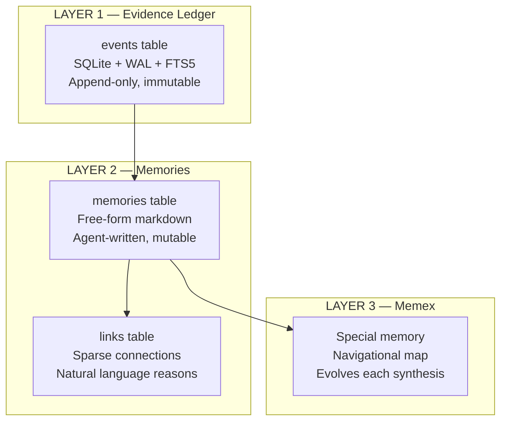

import { Callout, Steps, FileTree } from 'nextra/components'

# Memory Architecture

Syke's memory system treats **everything as language**. No embeddings, no typed relationship taxonomies, no rigid schemas. The synthesis agent reads text, writes text, and navigates text — the same way it processes anything else.

## Three Layers



### Layer 1: Evidence Ledger

Append-only event store. Immutable, timestamped, source-tagged. Events are never modified — this is the ground truth everything else is derived from.

```
events table
├── id: UUID7
├── user_id: string
├── source: "claude-code" | "github" | "chatgpt" | "gmail" | "manual"
├── timestamp: ISO 8601
├── event_type: "session" | "commit" | "conversation" | ...
├── title: string
├── content: text (full session/commit/email content)
└── metadata: JSON (source-specific fields)
```

### Layer 2: Memories

Free-form text units of knowledge, written and maintained by the synthesis agent. A memory can be anything: a person, a project, a preference, a decision, a story.

```
memories table
├── id: UUID7
├── user_id: string
├── content: text (free-form markdown, agent-written)
├── source_event_ids: JSON array (evidence that created this)
├── created_at / updated_at: timestamps
├── superseded_by: UUID7 | null (points to replacement)
└── active: boolean (false = retired, still queryable)
```

**15 tools** expose full CRUD to the synthesis agent:

**Write tools** (synthesis agent only):
```
create_memory(content, source_event_ids)    → new memory
create_link(source_id, target_id, reason)   → new link
update_memory(memory_id, new_content)       → edit in place (minor changes)
supersede_memory(memory_id, new_content)    → replace (major changes, keeps history)
deactivate_memory(memory_id, reason)        → retire (stays in ledger)
```

**Read tools** (ask agent + synthesis agent):
```
search_memories(query)                      → FTS5/BM25 search
search_evidence(query)                      → search raw events
follow_links(memory_id)                     → linked memories + reasons
get_memory(memory_id)                       → full content by ID
list_active_memories(limit)                 → compact index (ID + first line)
get_memory_history(memory_id)               → supersession chain
get_memex()                                 → the map (see Layer 3)
get_recent_memories(limit)                  → newest first
browse_timeline(since, before, source)      → time-windowed events
cross_reference(topic)                      → search across all platforms
```

### Layer 3: Memex (The Map)

A special memory (`source_event_ids = ["__memex__"]`) that acts as the agent's accumulated understanding of this person. Compact, navigational, and evolves with every synthesis cycle.

```markdown
# Memex — {user}

## What's Happening Now (stable entities)
[mem_xxx] Project Name — one-line status
[mem_yyy] Person — relationship context

## Patterns & Threads
Topic → search 'keyword' or follow_links(mem_xxx)
Recent → browse_timeline(since=last_week)

## Context
Sources: claude-code, github, chatgpt. N events. Last sync: date.
```

<Callout type="info">
**The memex is NOT a report — it's a map.** The agent reads this first, then navigates. It self-organizes based on what's actually important to this person — no prescribed structure.
</Callout>

## The Synthesis Loop

Runs after new events are ingested (daemon syncs every 15 minutes).

<Steps>

### Orient

Read the memex (the map). Understand what exists. Read new events since last synthesis.

### Extract & Evolve

For each new event, decide:
- New knowledge? → `create_memory` + `create_link`
- Updates existing? → `update_memory` or `supersede_memory`
- Makes something obsolete? → `deactivate_memory`
- Not worth remembering? → Skip

### Update the Map

Rewrite the memex with current state: what's active, key entities, temporal signals. Memex stays compact — it's a navigational index, not a dump.

</Steps>

The agent has full agency over memory decisions. It decides what's worth remembering, how to organize it, when to retire old knowledge. No heuristics — just language.

## Memory Lifecycle

```
soft    → synthesis creates it from new events
active  → reinforced across multiple sessions
solid   → repeatedly confirmed, becomes a key reference in the memex
dormant → user goes quiet → NOTHING HAPPENS
          memory sits in SQLite, still queryable, zero maintenance
          when user returns, everything is where they left it
```

Memories are permanent by default. Decay only runs during synthesis — if there's no synthesis (user is inactive), nothing decays. Zero maintenance cost.

## How ask() Works

When a user (or another AI tool) asks a question via the CLI (`syke ask`):

1. Agent reads the **memex** first — the map orients it
2. Agent uses **read tools** to navigate: search memories, follow links, browse timeline
3. Agent synthesizes an answer from what it finds
4. Answer is grounded in evidence — the agent can cite specific events and memories

The ask agent has access to all read tools but no write tools. It explores the existing knowledge base without modifying it.

## Key Design Decisions

**Why SQLite over vector DB?** Semantic understanding happens in the LLM, not the database. FTS5 with BM25 ranking handles keyword retrieval. The LLM decides what's relevant from the results. SQLite gives ACID transactions, concurrent reads (WAL mode), zero infrastructure, and a single portable file.

**Why free-form text over structured schemas?** The agent organizes knowledge the way it naturally thinks — in prose, markdown, lists, whatever fits. A memory about movie preferences might have categories like "with gf", "period films", "comfort watches" — organic structure that emerges from use, not imposed by schema.

**Why supersession over versioning?** When knowledge changes significantly, the old memory is deactivated and a new one takes its place. The chain is preserved: `get_memory_history()` walks the supersession links. Simpler than version control and matches how human memory works.

**Why sparse links over dense graphs?** A movie night memory links to a person, maybe to the movie, maybe to "date nights." Three links with natural language reasons. Not 50 typed relationships. The agent adds links when they're genuinely useful for navigation.

**Why a separate memex?** Without a map, the agent would need to search blindly every time. The memex gives it orientation — what exists, where to look, what's currently important.

## Stats

- **387 tests** passing (unit + integration)
- **15 memory tools** (10 read, 5 write)
- **~$0.25/synthesis** cycle (Sonnet, 10 turns max, $0.50 budget cap)
