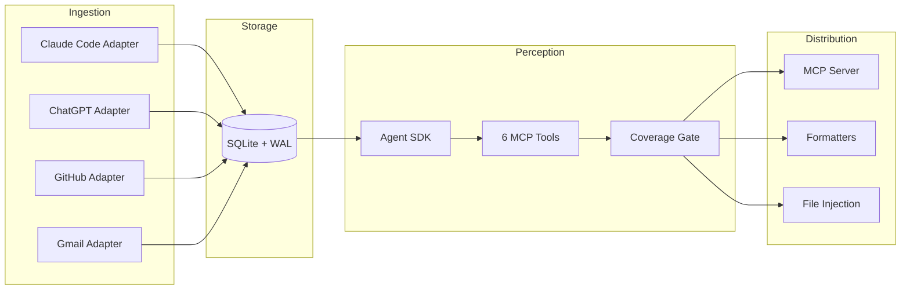

import { FileTree, Cards } from 'nextra/components'

# Architecture Overview

~6,500 source lines of Python. Four layers.

## Deep Dives

<Cards>
  <Cards.Card title="Perception" href="/architecture/perception" />
  <Cards.Card title="Ingestion" href="/architecture/ingestion" />
  <Cards.Card title="Distribution" href="/architecture/distribution" />
</Cards>

## Package Structure

<FileTree>
  <FileTree.Folder name="syke" defaultOpen>
    <FileTree.File name="cli.py" />
    <FileTree.File name="sync.py" />
    <FileTree.File name="config.py" />
    <FileTree.File name="db.py" />
    <FileTree.File name="models.py" />
    <FileTree.File name="metrics.py" />
    <FileTree.Folder name="ingestion" defaultOpen>
      <FileTree.File name="base.py" />
      <FileTree.File name="claude_code.py" />
      <FileTree.File name="chatgpt.py" />
      <FileTree.File name="github_.py" />
      <FileTree.File name="gmail.py" />
      <FileTree.File name="gateway.py" />
    </FileTree.Folder>
    <FileTree.Folder name="perception" defaultOpen>
      <FileTree.File name="agentic_perceiver.py" />
      <FileTree.File name="perceiver.py" />
      <FileTree.File name="tools.py" />
      <FileTree.File name="agent_prompts.py" />
      <FileTree.File name="prompts.py" />
    </FileTree.Folder>
    <FileTree.Folder name="distribution" defaultOpen>
      <FileTree.File name="ask_agent.py" />
      <FileTree.File name="formatters.py" />
      <FileTree.File name="inject.py" />
      <FileTree.File name="mcp_server.py" />
    </FileTree.Folder>
    <FileTree.Folder name="daemon">
      <FileTree.File name="daemon.py" />
      <FileTree.File name="metrics.py" />
    </FileTree.Folder>
    <FileTree.Folder name="llm">
      <FileTree.File name="client.py" />
    </FileTree.Folder>
  </FileTree.Folder>
</FileTree>

## Key Design Decisions

**The LLM does semantic understanding, not the database.** Syke doesn't need a vector DB. SQLite with WAL mode gives concurrent reads, ACID transactions, zero infrastructure. The perception agent does keyword search via tools — semantic understanding happens in Opus's thinking.

**Sessions, not messages.** A Claude Code session about "refactoring auth" contains 50+ messages but represents one coherent activity. Per-message would bloat the timeline 50x and force the agent to spend tokens reconstructing context.

**Privacy by design, not afterthought.** The content filter runs *before* events enter SQLite. Credentials and private messages never touch the database. Content that never enters the timeline can never be sent to an LLM.

**Hooks enforce quality for free.** Coverage gating via `PermissionResultDeny` forces the agent to explore all sources before submitting. Zero extra API cost — hooks piggyback on existing turns.

**Four formats for four consumers.** JSON for programs, Markdown for humans, CLAUDE.md for Claude Code projects, USER.md for portable identity. Same `UserProfile` schema, different shapes.
