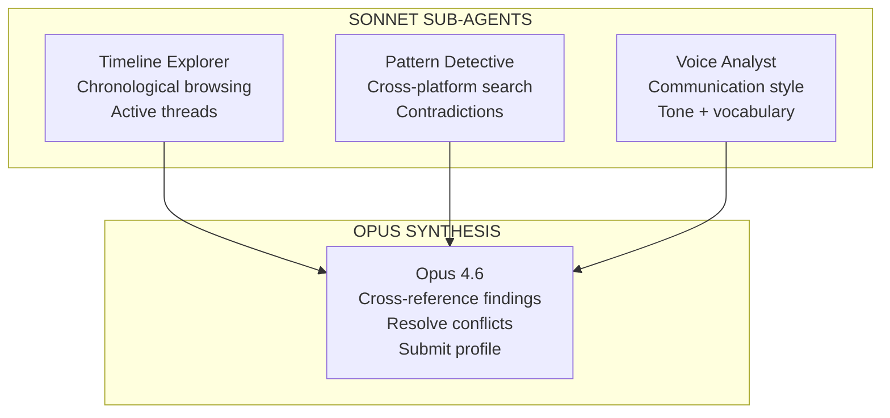

import { Callout, Steps } from 'nextra/components'

# Perception

The perception layer is where Syke pushes the boundaries of what's possible with the Agent SDK. Three modes, one output schema.

## Agentic Perception (Default)

The agent *explores* — it doesn't receive a text dump. Six custom MCP tools let it browse timelines, search across platforms, cross-reference topics, read its own prior profiles, and submit structured output.

### Agent SDK + Custom MCP Tools

```python
agent = Agent(
    model="claude-opus-4-6",
    tools=perception_tools,       # 6 MCP tools
    hooks=CoverageHooks(tracker), # PreToolUse coverage gate
    system_prompt=PERCEPTION_SYSTEM_PROMPT,
)
result = await agent.run(task_prompt)
```

<Callout>
**Active exploration, not passive processing.** The agent typically makes 5-12 targeted tool calls, forming hypotheses and testing them. It searches for a concept, discovers connections across platforms, and follows the thread. This is fundamentally different from dumping 100K tokens into a context window.
</Callout>

### Coverage Gating (PermissionResultDeny)

The Agent SDK's hook system enforces exploration quality. A `PreToolUse` hook tracks which sources the agent has browsed, searched, and cross-referenced.

```python
class CoverageHooks:
    async def on_pre_tool_use(self, tool_name, tool_input):
        if tool_name == "submit_profile":
            coverage = self.tracker.get_coverage()
            if not coverage.all_sources_explored():
                return PermissionResultDeny(
                    reason=f"Sources not explored: {coverage.missing}. "
                    "Explore first, then resubmit."
                )
```

The agent literally cannot submit a shallow profile. Zero extra API cost — hooks piggyback on existing turns.

## Multi-Agent Orchestration

Three Sonnet sub-agents explore in parallel:



Each sub-agent has constrained tool access via Agent SDK's `AgentDefinition`. Results are aggregated and Opus synthesizes the final profile.

## Strategy Evolution (ALMA)

This is the technical crown jewel. Inspired by the ALMA paper (Clune, 2026) — the agent evolves its own exploration strategy across runs.

<Steps>

### Explore

Agent runs perception, leaving a trace of every tool call and result.

### Trace

Record which searches returned useful results — cross-platform hits, novel discoveries, dead ends.

### Reflect

Deterministic analysis labels each search as productive or wasted. Zero LLM cost — pure heuristics.

### Evolve

Productive queries promoted, dead ends culled, new priorities discovered. The strategy file is updated.

</Steps>

<Callout type="info">
**Key discovery.** Searching for *concepts* beats searching for *project names*. "memory" appears across ChatGPT research, Claude Code sessions, and GitHub commits — while "Syke" only appears where the project is explicitly named. The agent learned this itself.
</Callout>

**12 runs. Real data. The system learned.**

| Strategy | Runs | Key Discovery | Best Run |
|----------|------|--------------|----------|
| v1 — Concept Search   | 1-3  | Broad baseline — project names and concept probes        | 89.9%      |
| v2 — Topic Expansion  | 4-6  | Abstract concepts outperform entity names                | **94.3%**  |
| v3 — Entity Discovery | 7-9  | Cross-platform connections without explicit prompting     | 88.1%      |
| v4 — Refined Ranking  | 10-12| Concept space stabilized, ALMA reaches #1                | 88.7%      |

Scores are per-run peaks from `evaluations.json`. Run-to-run variance is significant because search result quality depends on which keywords the agent tries first.

Total cost: $8.07 across 12 runs. Peak quality at $0.60/run — 67% cheaper than the $1.80 legacy baseline. Each run makes the next one better.

## Extended Thinking

16K+ token thinking budget lets Opus cross-reference signals deeply before synthesizing. The agent uses thinking to connect patterns across platforms — a GitHub commit, a ChatGPT thread, and an email about the same topic get woven into one coherent thread.

## Benchmarks

| | Legacy | Agentic v1 | Multi-Agent v2 | Meta-Best |
|---|-------:|----------:|---------------:|---:|
| Cost | $1.80 | $0.71 | $1.04 | **$0.60** |
| Eval score | -- | -- | -- | **94.3%** |
| Source coverage | 100% | 67% | 100% | 100%* |
| Cross-platform threads | 2 | 1 | 2 | 4 |
| Wall time | 119s | 160s | 225s | 189s |
