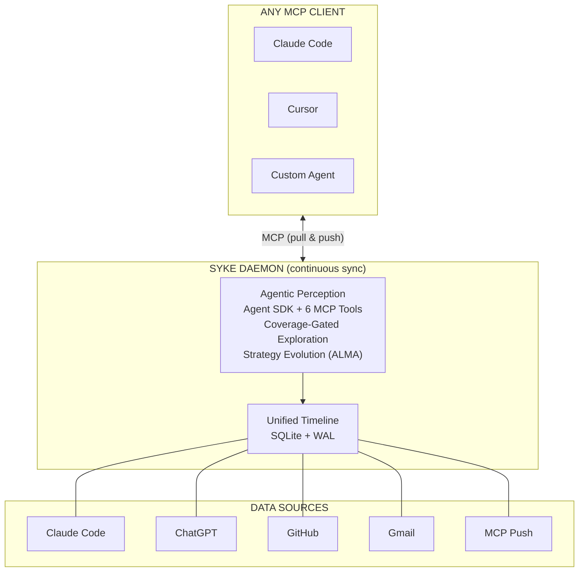

import { Callout, Tabs } from 'nextra/components'

# How It Works

Syke runs a continuous loop: collect signals from your platforms, perceive patterns across them, distribute context to every AI tool, and collect new signals back. Your identity evolves as you do.



<Callout type="info">
**Bidirectional sync.** Any MCP client can read your context *and* write events back. Your Claude Code session logs what you build. Your custom agent logs decisions. Everything feeds the living profile on next sync cycle.
</Callout>

## Ingestion

Platform adapters read data sources and produce `Event` objects stored in SQLite. Each adapter handles its own auth, pagination, and deduplication.

One event per session — not per message. A Claude Code session about "refactoring auth" is one event, not 50. Content capped at 50K chars.

## Perception

Agent SDK perception is what makes Syke different. The agent doesn't receive a text dump — it *explores* interactively using 6 custom MCP tools.

| Tool | What It Does |
|------|-------------|
| `get_source_overview` | Understand what data exists |
| `browse_timeline` | Browse events chronologically |
| `search_footprint` | Full-text keyword search |
| `cross_reference` | Search a topic across ALL platforms |
| `read_previous_profile` | Read prior perception for updates |
| `submit_profile` | Submit structured output (coverage-gated) |

The agent typically makes 5-12 targeted tool calls, forming hypotheses and testing them.

<Callout>
**Coverage gating.** The agent literally cannot submit a shallow profile. A `PreToolUse` hook blocks `submit_profile` until all sources are explored. Zero extra API cost — hooks piggyback on existing turns.
</Callout>

The agent doesn't just explore — it evolves its strategy across runs, learning which searches yield the richest cross-platform connections. See [Perception Architecture](/architecture/perception) for the ALMA details.

## Distribution

Four output formats, one MCP server.

<Tabs items={['CLAUDE.md', 'USER.md', 'Markdown', 'JSON']}>
<Tabs.Tab>
```markdown
# About alex
<!-- Generated by Syke from gmail, chatgpt, github (150 events) -->

A curious builder who loves exploring consciousness and technology.

## What's Active Right Now
🔥 **Distributed Cache Project**: Building an open-source Python caching library.
  - Multiple commits today
  - ChatGPT conversations about architecture

## Recent Context
Writing Python, exploring distributed systems patterns.

## Current World State
Active on a distributed systems side project. Also exploring AI-native tooling.

## How They Communicate
casual, intense, exploratory. Direct, fast-paced, mixes technical and philosophical.
```
</Tabs.Tab>
<Tabs.Tab>
```markdown
# User Profile: alex
<!-- Syke perception | gmail, chatgpt, github | 150 events -->

## Identity
A curious builder who loves exploring consciousness and technology.

## Current Focus
- **Distributed Cache Project**: Building an open-source Python caching library.

## Context
Writing Python, exploring distributed systems patterns.

## Current State
Active on a distributed systems side project. Also exploring AI-native tooling.

## Communication Preferences
Tone: casual, intense, exploratory
Style: Direct, fast-paced, mixes technical and philosophical.
```
</Tabs.Tab>
<Tabs.Tab>
```markdown
# alex — Syke Profile
*Generated 2026-02-15 14:30 from gmail, chatgpt, github (150 events)*

## Who They Are
A curious builder who loves exploring consciousness and technology.

## Active Threads
### Distributed Cache Project [high]
Building an open-source Python caching library.
*Seen on: github, chatgpt*
Recent signals:
- Multiple commits today
- ChatGPT conversations about architecture

## Recent Context
Writing Python, exploring distributed systems patterns.

## Background
Has been thinking about AI personalization for years.

## World State
Active on a distributed systems side project. Also exploring AI-native tooling.

## Voice & Communication
**Tone**: casual, intense, exploratory
**Style**: Direct, fast-paced, mixes technical and philosophical.
**Vocabulary**: uses 'vibe' often, says 'ship it'

**Examples**:
> Let's just ship this and iterate.
```
</Tabs.Tab>
<Tabs.Tab>
```json
{
  "user_id": "alex",
  "identity_anchor": "A curious builder who loves exploring consciousness and technology.",
  "active_threads": [
    {
      "name": "Distributed Cache Project",
      "description": "Building an open-source Python caching library.",
      "intensity": "high",
      "platforms": ["github", "chatgpt"],
      "recent_signals": [
        "Multiple commits today",
        "ChatGPT conversations about architecture"
      ]
    }
  ],
  "recent_detail": "Writing Python, exploring distributed systems patterns.",
  "background_context": "Has been thinking about AI personalization for years.",
  "world_state": "Active on a distributed systems side project. Also exploring AI-native tooling.",
  "voice_patterns": {
    "tone": "casual, intense, exploratory",
    "vocabulary_notes": ["uses 'vibe' often", "says 'ship it'"],
    "communication_style": "Direct, fast-paced, mixes technical and philosophical.",
    "examples": ["Let's just ship this and iterate."]
  },
  "sources": ["gmail", "chatgpt", "github"],
  "events_count": 150
}
```
</Tabs.Tab>
</Tabs>

The MCP server exposes 8 tools for pull (read context) and push (write context from any client). See [MCP Server](/guide/mcp-server) for details.
