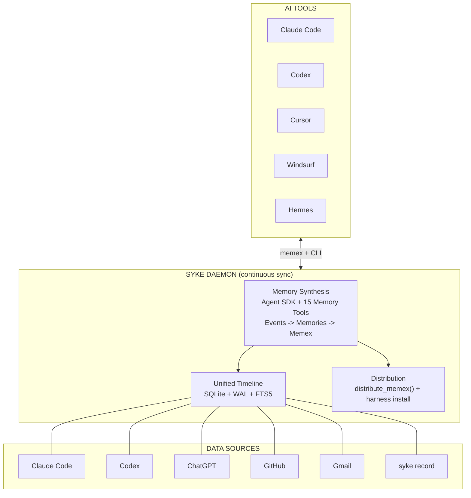

import { Callout, Tabs } from 'nextra/components'

# How It Works

Syke runs a continuous loop: ingest platform signals, synthesize memory, distribute the memex to tool surfaces, and repeat on the daemon cadence.


```mermaid
graph TB
    subgraph Clients["AI TOOLS"]
        CC[Claude Code]
        CX[Codex]
        CU[Cursor]
        WS[Windsurf]
        HM[Hermes]
    end

    subgraph Syke["SYKE DAEMON (continuous sync)"]
        IS["Memory Synthesis\nAgent SDK + 15 Memory Tools\nEvents -> Memories -> Memex"]
        TL["Unified Timeline\nSQLite + WAL + FTS5"]
        DS["Distribution\ndistribute_memex() + harness install"]
        IS --> TL
        IS --> DS
    end

    subgraph Sources["DATA SOURCES"]
        S1[Claude Code]
        S2[Codex]
        S3[ChatGPT]
        S4[GitHub]
        S5[Gmail]
        S6[syke record]
    end

    Clients <-->|"memex + CLI"| Syke
    TL --- S1 & S2 & S3 & S4 & S5 & S6
```

<Callout type="info">
Bidirectional loop: read via `syke context` (or injected context files), write via `syke record`, ingest platform activity, then synthesize again.
</Callout>

## Ingestion

Platform adapters produce normalized `Event` records in SQLite. Current adapters: `claude-code`, `codex`, `chatgpt`, `github`, `gmail`.

Events are deduplicated by `external_id`, filtered before insert (credentials/private-message checks), and preserved as immutable evidence.

## Memory Synthesis

After ingestion, synthesis reads the memex first, explores new evidence, and updates the memory layer with 15 tools.

| Tool | What It Does |
|------|-------------|
| `get_memex()` | Read current navigational map |
| `search_memories(query)` | FTS5/BM25 search across all memories |
| `search_evidence(query)` | Search raw events for ground truth |
| `follow_links(memory_id)` | Traverse linked memories |
| `create_memory(content, ...)` | Write new knowledge from events |
| `supersede_memory(id, ...)` | Replace outdated knowledge, keep history |
| `create_link(source, target, reason)` | Connect related memories |

The agent decides what to keep, update, link, supersede, or deactivate.

<Callout>
**Evidence ≠ inference.** Raw events (what happened) are immutable. Memories (what it means) are mutable and agent-written. The synthesis agent reads events and writes memories — the two layers never mix.
</Callout>

See [Memory Architecture](/architecture/memory) for the full three-layer design.

## Distribution

Distribution runs after synthesis in `sync.py`:
- `distribute_memex()` writes `~/.syke/data/{user}/CLAUDE.md`
- `ensure_claude_include()` maintains include in `~/.claude/CLAUDE.md`
- `install_skill()` updates skills dirs (`~/.claude/skills`, `~/.codex/skills`, `~/.cursor/skills`, `~/.windsurf/skills`)
- harness adapters refresh Hermes + Claude Desktop integration

The memex is the primary artifact; `syke context`, `syke ask`, and `syke record` are the runtime interaction surface.

<Tabs items={['Memex Snapshot', 'CLI Surface']}>
<Tabs.Tab>
```markdown
# Memex — dev

## Identity
Full-stack engineer building AI developer tools.

## What's Active
- Syke v0.4.5 release and docs hardening
- Client delivery planning in Gmail and GitHub

## Context
Direct communication style, bias for concise technical answers.

Sources: claude-code, codex, github, gmail. Events: 6000+.
```
</Tabs.Tab>
<Tabs.Tab>
```bash
syke context
syke ask "what was I shipping this week?"
syke record "Settled on docs freeze scope"
```
</Tabs.Tab>
</Tabs>

See [Context Distribution](/guide/context-distribution) for the distribution path details.
