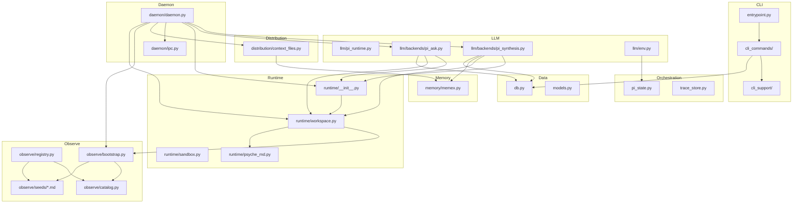

# Syke Memory Architecture

> How Syke builds a living, self-evolving model of who you are.

---

## Design Philosophy

Memory is not search. Syke is not trying to be a generic retrieval layer. It is agentic memory: a system that reads activity across many harnesses directly, builds learned memories from that evidence, and maintains a memex that routes future agents through accumulated knowledge.

## At A Glance

Operationally, the current system is simple:

1. `syke auth ...` selects the provider Syke will run with.
2. Adapter markdowns describe each harness's data format and location.
3. The agent reads harness data directly via those adapter guides and bash/sqlite3.
4. Syke writes learned mutable memory into `syke.db`.
5. Pi runs `ask` and synthesis with: MEMEX + adapter markdowns + bash/sqlite3.
6. External harnesses consume memex projections and other downstream distribution files.

Authority is split cleanly:

- `~/.syke/syke.db` is the authoritative mutable memory store (real file, not a symlink)
- `~/.syke/adapters/{source}.md` tells the agent how to read each harness
- `~/.syke/MEMEX.md` is the routed workspace/read surface
- the MEMEX is the timeline, indexed by synthesis cycle numbers (190+ cycles in cycle_records)
- harness-specific files are projections, not the source of truth

**What makes this different:**

**Memory is identity, not retrieval.** Most memory systems are glorified search engines — ingest data, embed it, retrieve it. Syke's thesis is that memory IS the user's computational identity. The memex doesn't just answer questions about what happened — it reflects who this person is, what they care about, how they think. The system evolves its own understanding rather than waiting to be queried.

**User-owned, federated, portable.** One user-owned SQLite store (`syke.db`) plus adapter markdowns per harness. No cloud dependency, no vendor lock-in. Copy the user data directory, move it anywhere. The user owns their memory — Syke is the harness, not the host.

**Dynamic and self-evolving.** Harness data stays at the source. The memex is mutable. The synthesis loop decides how the memex should change as the agent reads new harness activity. Today that loop is driven by a static skill prompt file (`syke/llm/backends/skills/pi_synthesis.md`) loaded at cycle start; the contract evolves through repository edits and experiments, not through runtime prompt generation.

**Designed for multi-agent work.** Syke is built for a world where multiple AI agents operate across the same user's work and each needs context. The memex becomes a shared dashboard for what matters, what is active, and where deeper evidence lives.

**Reflects implicit ontology.** Every person has a unique mental model — how they organize projects, what they prioritize, how they communicate. Traditional software imposes a fixed schema. Syke lets the agent discover the user's ontology from usage patterns and adapt the memory layer over time.

**Memory is maintenance.** Beyond store and retrieve, memory needs active care: synthesis cycles, cron-driven updates, health checks, evolution tracking. This is why agentic memory requires an agent — not just a database with an API, but an autonomous process that maintains, curates, and evolves the knowledge base.

**Core principles:**
- **The agent reads harness data directly** — adapter markdowns describe format and location; the agent uses bash/sqlite3 to inspect harness artifacts at synthesis time. No Python copy pipeline, no events.db staging.
- **Evidence ≠ inference** — raw harness data (what happened) stays at the source; memories (what it means) are mutable and agent-written in syke.db
- **The agent crawls text** — FTS5/BM25 for retrieval, LLM for understanding. No vector DB needed.
- **Graph over SQLite** — memories connect through sparse, bidirectional links with natural language reasons
- **The map appears** — the agent builds its own world model with each use, like fog of war clearing
- **The MEMEX is the timeline** — indexed by synthesis cycle numbers, it is the navigational backbone that accumulates across 190+ cycles

```
┌─────────────────────────────────────────────────────────┐
│              Layer 1: Harness Data (at source)           │
│              ┌──────────────────────┐                    │
│              │ JSONL, SQLite, JSON  │                    │
│              │ read via adapter.md  │                    │
│              └──────────┬───────────┘                    │
│                         │ agent reads directly           │
├─────────────────────────┼───────────────────────────────┤
│              Layer 2: Memories + Graph (syke.db)         │
│                         │                                │
│         ┌───────────────▼───────────────┐                │
│         │          Memories             │                │
│         │   (free-form text, agent-     │                │
│         │    written, FTS5-indexed)     │                │
│         └───────┬───────────┬───────────┘                │
│                 │           │                            │
│          ┌──────▼──────┐    │                            │
│          │    Links    │    │                            │
│          │  (sparse,   │    │                            │
│          │  bidirect., │    │                            │
│          │  NL reasons)│    │                            │
│          └─────────────┘    │                            │
│                             │ agent rewrites             │
├─────────────────────────────┼───────────────────────────┤
│              Layer 3: Memex (The Map / Timeline)         │
│         ┌───────────────▼───────────────┐                │
│         │  Navigational index of who    │                │
│         │  this person is. Routes to    │                │
│         │  memories, indexed by cycle.  │                │
│         └───────────────────────────────┘                │
├─────────────────────────────────────────────────────────┤
│              Layer 4: Memory Ops + Cycle Records         │
│         ┌───────────────────────────────┐                │
│         │  Audit trail + training data  │                │
│         │  Every op logged: create,     │                │
│         │  update, supersede, link      │                │
│         │  cycle_records track synth    │                │
│         └───────────────────────────────┘                │
└─────────────────────────────────────────────────────────┘
```

---

## Layer Architecture

### Layer 1: Harness Data (At Source)

Harness data stays where the harness wrote it. There is no copy pipeline, no events.db staging, no Python adapters parsing data into a ledger.

Instead, each harness gets an **adapter markdown** installed at `~/.syke/adapters/{source}.md`. This file tells the agent:

- where the harness stores its data (paths, file formats)
- how to read it (JSONL structure, SQLite schemas, JSON layout)
- what to look for (sessions, turns, tool calls, timestamps)

The agent reads harness data directly using bash and sqlite3 during synthesis and ask.

### Observe Bootstrap

Observe is the adapter markdown installation surface, not a runtime ingest boundary.

`initialize_workspace()` is called once by the daemon at startup (or by setup). It calls `ensure_adapters()` which:

- iterates active harness sources from the catalog
- installs the shipped seed adapter markdown if not already present

Adapter markdowns are shipped as seed files in `syke/observe/seeds/` (e.g., `adapter-claude-code.md`, `adapter-cursor.md`). There is no factory, no Python adapter ABC, no validator, no watcher runtime.

### Layer 2: Memex

The memex is the current mutable routing layer. It is one agent-managed artifact that gives both humans and agents orientation: what exists, what is active, what changed, and where deeper evidence lives.

The memex is currently stored in the main Syke DB and projected into the Pi workspace as `MEMEX.md`. Product-wise it should be understood as the primary mutable artifact, not as one memory among many.

The important point is that the Pi runtime receives the Syke workspace contract and can:

- read harness data directly via adapter markdowns and bash/sqlite3
- update mutable learned state in `syke.db`
- rewrite `MEMEX.md`
- persist session artifacts and helper scripts inside the workspace

`syke ask` and synthesis both route through the same Pi runtime. The difference is grounding and orchestration, not a separate non-Pi backend. The prompt envelope they share — `<psyche>` (identity) + `<memex>` (memory) + `<synthesis>` or `<ask>` (task) — is described in [MEMEX_UPDATE_2.md](MEMEX_UPDATE_2.md#psyche--the-second-top-level-artifact).

### Layer 3: Distribution

The memex is rendered back into agent environments. The authoritative mutable state lives in `syke.db`, and `MEMEX.md` is the routed workspace projection of that state. Registered Syke capability files are distribution sinks, not the product boundary.

```markdown
# Memex — {user}

## What's Happening Now (stable entities)
[mem_xxx] Project Name — one-line status
[mem_yyy] Person — relationship context

## Patterns & Threads
Topic → search 'keyword' or query linked memories for mem_xxx
Recent → query events since last_week

## Context
Sources: claude-code, github, chatgpt. N events. Last sync: date.
```

The memex is a map. The agent reads this first, then navigates. It self-organizes around what is actually important in the user's work instead of following a fixed structure. Over time, it becomes a shared dashboard between the user and their AI agents — a live view of what matters, what is moving, and where to look.

Current distribution is intentionally simple:

- trusted Syke owns the live store, auth, and metrics
- Pi consumes the local workspace contract directly
- external agent environments consume exported views of the memex
- `syke memex` is the most reliable read surface
- `syke ask` is deeper, but some external sandboxes cannot open the live store directly yet

Operationally, each sync/distribution refresh now updates the downstream sinks that exist on the machine:

- exported memex file under the user's Syke data dir
- registered Syke capability files for detected harness capability surfaces

So the current operational boundary is not "every sandbox can query the DB." It is "every sandbox should at least receive the memex, and trusted Syke can answer deeper questions when direct access is available."

### Layer 4: Cycle Records And Audit

Every synthesis cycle is logged with timing, cost, tokens, and outcome. Rollout traces are persisted in `syke.db` (not metrics JSONL or observer events). Self-observation events and experiment artifacts then provide the substrate for later eval and prompt iteration.

Self-observation is part of the same system, not a separate analytics plane. Runtime events such as ask lifecycle, synthesis lifecycle, daemon events, and tool observations are written back as `source='syke'` telemetry events in `syke.db` so the system can reason over its own behavior as well as user and harness activity.

---

## Runtime Boundary: Pi And Syke

Syke now treats Pi as the canonical agent runtime, not as a swappable stateless backend.

Pi is responsible for runtime concerns:

- agent execution and tool orchestration
- session lifecycle and session persistence
- provider/model execution after Syke prepares config and workspace
- runtime event streaming, retries, compaction, and runtime exports
- enforcing the Syke-controlled workspace sandbox during ask and synthesis

Syke is responsible for memory-product concerns:

- installing adapter markdowns so the agent can read harness data directly
- defining the workspace contract: `syke.db`, `MEMEX.md`, adapter markdowns
- deciding synthesis policy, ask grounding, and replay semantics
- tracking product metrics, self-observation, and outbound capability distribution
- orchestrating the daemon: scheduling, IPC, distribution

This is the practical split:

- Pi owns how the agent runs
- Syke owns what the agent knows, what sources it can inspect, and how those results become durable memory

## Sandbox Boundary

Syke uses an OS-level sandbox with deny-default reads. On macOS, this is a seatbelt profile generated per user at launch time. The profile is catalog-scoped: only harness directories known to the catalog plus system paths are readable. Everything else (`~/Documents`, `~/.ssh`, `~/.gnupg`, etc.) is denied by default.

The sandbox applies to ask and synthesis. It controls:

- filesystem reads: deny-default, catalog-scoped per-user profile whitelists harness data paths + system paths
- filesystem writes: restricted to `~/.syke/` workspace + temp dirs
- network: outbound is allowed so provider calls work; port-level filtering was tested and deferred
- sensitive path denies: `.ssh`, `.gnupg`, `.aws`, `.azure`, `.docker`, `.kube`, `.config/gcloud` explicitly denied as defense-in-depth

The agent has read access to harness data directories as described by adapter markdowns, and read/write access to `~/.syke/`.

External harness sandboxes still exist, but they are downstream environment constraints rather than part of Syke's internal runtime model. In practice:

- internal Syke sandbox = OS-level deny-default sandbox around the Pi runtime
- external harness sandboxes = consumers of memex/capability distribution that may or may not reach the live store

---

## Graph over SQLite

Human memory is associative. You don't retrieve memories by index — you follow connections. A project reminds you of a person, who reminds you of a conversation, which connects to a decision. Syke models this with explicit links — sparse, bidirectional edges with natural language reasons, implemented over SQLite.

```
┌──────────────┐     ┌──────────────────────────┐         ┌──────────┐
│ HARNESS DATA │     │        MEMORIES          │         │  MEMEX   │
│──────────────│     │──────────────────────────│ routes  │──────────│
│ JSONL/SQLite │     │ id                       │────────►│ id       │
│ (at source)  │────►│ content (agent-written)  │   to    │ content  │
│ via adapter  │reads│ active                   │         │ (the map)│
│ markdowns    │     │                          │         └──────────┘
└──────────────┘     └─────┬──────────┬─────────┘
                           │          │
                           │  ┌───────▼────────┐
                           │  │     LINKS      │
                           │  │────────────────│
                           │  │ source_id ──►  │
                           └──│ target_id ──►  │
                              │ reason (NL)    │
                              └────────────────┘

        Bidirectional: agent queries both directions via SQL.
        Sparse: 3-5 links per memory, not hundreds.
```

The agent creates links during synthesis via `sqlite3` INSERT and navigates them during ask via SQL queries. Links are bidirectional — the agent queries both directions, returning connected memories with their reasons.

### Why This Works

The [MEMEX_EVOLUTION](MEMEX_EVOLUTION.md) experiment proved that even without explicit graph infrastructure — just agent context engineering (ACE) — the synthesis agent invented pointers on its own under budget pressure. It compressed its memex from inline detail to `→ Memory: {id}` references, discovering indirection as a compression strategy. When the pointer instruction was removed entirely, the agent crashed, recovered, and invented pointers anyway.

The links table makes this emergent pattern first-class. Instead of relying on emergence alone, the agent has explicit tools to create and traverse connections. The graph structure that the agent discovered naturally now has infrastructure to support it.

### Why Not a Graph Database

The graph is sparse — 3-5 links per memory, not hundreds. Two indexed columns (`source_id`, `target_id`) and a JOIN handle bidirectional traversal. Graph databases solve dense traversal problems Syke doesn't have. And the graph lives in the same SQLite file as everything else — one portable file, not two services.

### Why free-form text over structured schemas?

The agent organizes knowledge the way it naturally thinks — in prose, markdown, lists, whatever fits. A memory about movie preferences might have categories like "with gf", "period films", "comfort watches" — organic structure that emerges from use, not imposed by schema.

### Why supersession over versioning?

When knowledge changes significantly, the old memory is deactivated and a new one takes its place. The chain is preserved: querying the `superseded_by` column walks the supersession links. This is simpler than version control and matches how human memory works — you don't version your beliefs, you update them.

### Why a separate memex?

Without a map, the agent would need to search blindly every time. The memex gives it orientation — what exists, where to look, what's currently important. It's the difference between exploring a city with and without a map.

---

## Inspiration

Syke's memory architecture draws from several research directions:

**[ACE — Agentic Context Engineering](https://arxiv.org/abs/2510.04618)** (Zhang et al. — Stanford/Microsoft, ICLR 2026): Treats contexts as evolving playbooks that accumulate, refine, and organize strategies through generation, reflection, and curation. Syke's synthesis loop is an ACE implementation — the memex is a playbook that evolves with each cycle, accumulating the user's strategies and knowledge rather than summarizing them away. The MEMEX_EVOLUTION experiment is direct evidence of ACE dynamics: the agent developed its own compression and routing strategies under budget pressure.

**[RLM — Recursive Language Models](https://arxiv.org/abs/2512.24601)** (Zhang, Kraska, Khattab — MIT CSAIL, Dec 2025): Treats long prompts as an external environment the LLM programmatically examines, decomposes, and recursively calls itself over. Syke borrows the core idea: memory lives outside the context window, and the agent navigates it via tools rather than stuffing everything into the prompt.

**[ALMA — Automated Meta-Learning of Memory designs for Agentic systems](https://arxiv.org/abs/2602.07755)** (Xiong, Hu, Clune — Feb 2026): A Meta Agent searches over memory designs (database schemas, retrieval and update mechanisms) expressed as executable code, outperforming hand-crafted designs by 6-12 points. Syke's takeaway: design around a pluggable `update()`/`retrieve()` protocol so the memory architecture can evolve without rewriting the agent.

**[LCM — Lossless Context Management](https://papers.voltropy.com/LCM)** (Ehrlich, Blackman — Voltropy, Feb 2026): Decomposes RLM-style recursion into deterministic, engine-managed primitives — a DAG-based hierarchical summary system that compacts older messages while retaining lossless pointers to originals. Syke's takeaway: hierarchical compression where recent context stays full, older context compacts, and nothing is truly lost.

**Syke-native**: Session atomicity, evidence ≠ inference, sparse links, agent crawls text, portable SQLite, and the map appearing bottom-up from exploration.

---

## File Map

```
syke/
├── entrypoint.py               # Click CLI group + command registration
├── cli_commands/               # Modular CLI command implementations
│   ├── ask.py                  # syke ask — grounded question answering
│   ├── auth.py                 # syke auth — provider credential management
│   ├── config.py               # syke config — config inspection and init
│   ├── daemon.py               # syke daemon — background loop control
│   ├── maintenance.py          # syke cost, sync, install-current
│   ├── record.py               # syke record — append observations
│   ├── setup.py                # syke setup — first-run onboarding
│   └── status.py               # syke status, memex, observe, doctor, connect
├── cli_support/                # Shared CLI infrastructure
│   ├── ask_output.py           # Ask streaming + structured output formatting
│   ├── auth_flow.py            # Interactive auth and setup flows
│   ├── context.py              # Shared runtime context helpers (get_db, registry)
│   ├── daemon_state.py         # Daemon lifecycle state inspection
│   ├── dashboard.py            # Default bare-invocation dashboard
│   ├── doctor.py               # Health check payload building
│   ├── exit_codes.py           # Unified exit code scheme (0-6)
│   ├── installers.py           # Install method detection + managed installs
│   ├── providers.py            # Provider introspection and description
│   ├── render.py               # Unified Rich output formatting
│   └── setup_support.py        # Setup workflow helpers
├── config.py                   # Runtime constants + env/config resolution
├── config_file.py              # Typed TOML schema + parser + default template
├── db.py                       # SQLite + WAL + FTS5, memories + memex + cycle records
├── models.py                   # Memory-layer models
├── trace_store.py              # Canonical rollout trace persistence in syke.db
├── health.py                   # Memory/system health scoring
├── pi_state.py                 # Syke-owned Pi agent state + audit logging
├── daemon/
│   ├── daemon.py               # Background loop with fcntl lock + adaptive retry
│   ├── ipc.py                  # Unix domain socket IPC (ask + runtime_status)
│   └── metrics.py              # Daemon metrics/logging helpers
├── distribution/
│   ├── __init__.py             # Distribution refresh orchestration
│   └── context_files.py        # Memex export and capability registration
├── llm/                        # Thin Pi-native runtime helpers
│   ├── pi_runtime.py           # Pi-native ask/synthesis dispatcher
│   ├── backends/               # Canonical backend implementations
│   │   ├── pi_ask.py           # Pi ask() agent
│   │   ├── pi_synthesis.py     # Pi synthesis agent
│   │   └── skills/
│   │       └── pi_synthesis.md # Pi synthesis skill prompt
│   ├── pi_client.py            # Pi RPC client + singleton runtime lifecycle
│   ├── env.py                  # Provider resolution + Pi env construction
│   ├── pi_settings.py          # Workspace-local .pi/settings.json generation
│   └── __init__.py             # Public Pi-native LLM helpers
├── observe/                    # Adapter markdown installation + harness catalog
│   ├── __init__.py             # Public API: catalog, bootstrap, trace
│   ├── bootstrap.py            # Install adapter markdowns for active harnesses
│   ├── catalog.py              # Centralized SourceSpec catalog
│   ├── content_filter.py       # Pre-ingestion privacy and credential filters
│   ├── registry.py             # Adapter resolution
│   ├── trace.py                # System telemetry (source='syke' events)
│   └── seeds/                  # Shipped adapter markdown guides
│       ├── adapter-claude-code.md
│       ├── adapter-codex.md
│       ├── adapter-copilot.md
│       ├── adapter-cursor.md
│       ├── adapter-gemini-cli.md
│       ├── adapter-hermes.md
│       ├── adapter-opencode.md
│       └── adapter-antigravity.md
├── memory/
│   └── memex.py                # Memex read/write/bootstrap
└── runtime/
    ├── __init__.py             # PiRuntime singleton lifecycle management
    ├── workspace.py            # Workspace path constants + initialize_workspace()
    ├── locator.py              # Runtime locator helpers
    ├── psyche_md.py            # PSYCHE.md agent identity generation
    ├── sandbox.py              # OS-level deny-default sandbox (macOS seatbelt)
    └── pi_settings.py          # Workspace-local .pi/settings.json generation
```

---

## Current Runtime Notes

- architecture and synthesis are still under active experimentation
- **Pi-only runtime** for ask and synthesis
- **workspace contract** = `syke.db`, `MEMEX.md`, `PSYCHE.md`, adapter markdowns, `sessions/`
- **agent reads harness data directly** via adapter.md guides + bash/sqlite3
- **MEMEX is the timeline** indexed by synthesis cycle numbers (190+ in cycle_records)
- **SQLite + FTS5** for storage and retrieval (FTS5 sync via triggers)
- **macOS-first daemon workflow** today

---

## Agent Runtime Architecture

Syke now supports one agent runtime for synthesis and ask operations: Pi. `pi_runtime.py` is the dispatcher used by the CLI and routes directly to Pi implementations.

### Pi Runtime Dispatcher (`syke/llm/pi_runtime.py`)

The Pi dispatcher is the routing layer:

```
CLI / Sync / Daemon / Replay
        ↓
   pi_runtime.run_ask()
   pi_synthesize()
        ↓
     Pi Runtime
```

All callers should treat `pi_runtime` as the ask dispatch layer, while synthesis uses the Pi backend directly.

### Pi Runtime (Canonical)

- **Implementation**: `syke/llm/backends/pi_ask.py`, `syke/llm/backends/pi_synthesis.py`
- **Runtime**: Pi RPC subprocess (`syke/llm/pi_client.py`) — singleton lifecycle in `syke/runtime/`
- **Workspace**: Persistent `~/.syke/` with writable `syke.db` (real file), routed `MEMEX.md`, `PSYCHE.md` (agent identity), adapter markdowns in `adapters/`, and session artifacts
- **Tools**: Pi's built-in runtime tool surface
- **Metrics**: Pi-native duration, provider/model, token, cache, cost, and tool-call telemetry
- **Best for**: The normal Syke runtime path

---

## Distribution Surfaces

Distribution is intentionally narrow:

- CLI is the trusted control plane
- synthesis writes the canonical memex artifact at `~/.syke/MEMEX.md`
- capability distribution installs `SKILL.md` (and native wrappers where needed) to detected harness surfaces

Anything outside those surfaces is out of scope for the current runtime.

---

## LLM Provider Layer

Syke uses Pi as the canonical runtime and no longer keeps a separate provider registry or auth store.

```
                    ┌────────────────────┐
                    │   Pi Coding Agent  │
                    │  RPC + workspace   │
                    └─────────┬──────────┘
                              │
                    ┌─────────▼──────────┐
                    │   Pi provider      │
                    │   catalog + auth   │
                    └─────────┬──────────┘
                              │
                    ┌─────────▼──────────┐
                    │ ~/.syke/pi-agent   │
                    │ auth/settings/models│
                    └────────────────────┘
```

### Environment Isolation

Pi subprocesses use a bounded child environment plus the Syke-owned Pi agent directory. Workspace-local `.pi/settings.json` is generated by `syke/runtime/pi_settings.py`.

### Auth & Config

Credentials are stored in `~/.syke/pi-agent/auth.json`. Active provider/model live in `~/.syke/pi-agent/settings.json`. Provider endpoint/base-url overrides live in `~/.syke/pi-agent/models.json`. `config.toml` no longer owns provider or model truth. See `docs/CONFIG_REFERENCE.md` for the current config contract.

---

## Module Dependency Graph



Use the module graph above as the public entry point for navigating the current tree.
