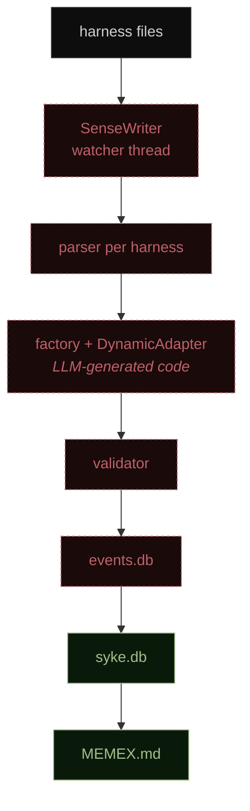
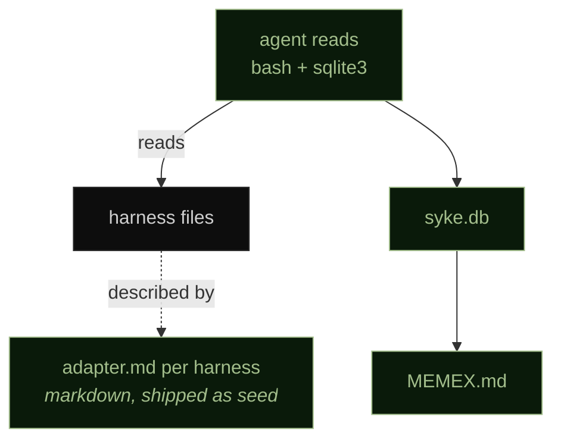
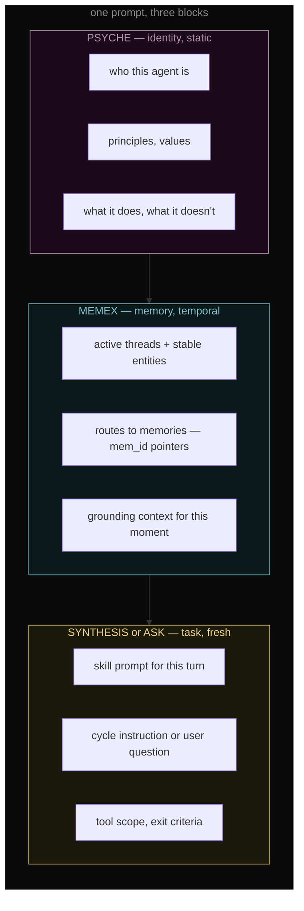

# Memex Update 2 — The Cleanup

> Second chapter. [MEMEX_EVOLUTION.md](MEMEX_EVOLUTION.md) stopped in late February with the agent inventing pointers. What follows is the 0.5.2 release, six weeks later. The user did the work; this text is AI-generated, drawn from the CHANGELOG, commit history and live runtime, written in the voice of the first chapter.

---

## Where the Last Chapter Left Us

Late February. The memex had learned to point. Day 6 it stopped copying knowledge into the map and started pointing to the memories that held the story. Fourteen more days unattended — 6,378 events, 182 memories, 111 memex versions — and the map was self-maintaining.

That experiment proved continual learning in the memex. The architecture around it was a different story.

Events came in through a Python adapter pipeline. A watcher thread called `SenseWriter`, a factory that generated adapters at runtime, a validator, an `ObserveAdapter` ABC, parsers per harness, importers, a content filter, a ledger database (`events.db`) separate from the memory database (`syke.db`). The write path from "a session happened in Claude Code" to "the agent can reason about it" crossed eight modules and two databases. Each one could fail. Each one had to be tested. Each one was LLM-touched code running at full process privilege.

The experiment was real. The scaffolding was not.

---

## The Delete

Between mid-March and mid-April, roughly 12,638 lines of ingestion infrastructure were deleted. `SenseWriter`, `SenseWatcher`, `SQLiteWatcher`, `JsonlTailer` — gone. The `ObserveAdapter` ABC and the `DynamicAdapter` that generated concrete adapters by prompting an LLM at runtime — gone. The factory skill, the validator, the parsers, the importers — gone. `syke/sync.py`, `syke/memory/synthesis.py`, `syke/memory/tools.py`, `syke/distribution/ask_agent.py` — gone.

One number: +8.8K / −18.5K across 157 files over 116 commits. Net **−9.7K**. The product got smaller.

Why the delete had to happen:

- The dual-store model (`events.db` for evidence, `syke.db` for memories) wanted a cross-connection `BEGIN IMMEDIATE` for every ingest. Two SQLite connections cannot transact atomically. The code tried anyway.
- The `DynamicAdapter` pattern — LLM generates adapter code, Python `exec_module`s it, runs it — was a CVE-shaped hole. The agent reading your harness data does not need Python execution privileges.
- The watcher thread's bounded queue (10K events) would have stalled under burst ingestion. It had not yet; the architecture was one burst away.
- Every cycle paid the tax. Format, parse, validate, store, index, project. Nine module hops for data the agent could just read.

The new path: adapter *markdowns* in `~/.syke/adapters/`, one per harness, describing where the data lives and how to read it. The agent `cat`s JSONL, runs `sqlite3` against harness DBs, filters by time. Raw harness files stay where the harness wrote them. Zero Python in the read path.

Old paradigm: ingest → parse → store → retrieve.
New paradigm: the agent reads.

### Before — 0.5.1



### After — 0.5.2



Red dashed is deleted. Green solid is kept. Five modules plus the second database dropped out of the write path. The write path went from nine module hops to zero — the agent reads, no Python in between.

---

## Single Store

`events.db` merged into `syke.db`. One file holds memories, links, event projections, rollout traces, cycle records. Synthesis runs inside one `db.transaction()` — cursor advance, memex sync, cycle record completion all commit together or all roll back.

OPEN_LOOPS had logged the synthesis commit non-atomicity as CRITICAL in March. The fix was not a new transaction helper. The fix was removing the reason there were two connections.

---

## PSYCHE — The Second Top-Level Artifact

`~/.syke/MEMEX.md` used to be the only top-level artifact in the workspace. As of 0.5.2 there is `~/.syke/PSYCHE.md` beside it.

The split is sharper than it sounds:

- **MEMEX** — what the agent knows. Temporal. Mutable. The routing map from the first chapter, still evolving every cycle.
- **PSYCHE** — who the agent is. Static identity contract. Injected into every prompt so the agent has a sense of self before it has a sense of task.

The motivation was an ask-identity bug. Broad queries — `what am I working on`, `who am I` — came back stateless. Zero tool calls, generic answers. The agent had memory but no self. Identity-as-context is what fixes that.

MEMEX, PSYCHE and the task-specific skill prompt now land in the same envelope:

```
<psyche>     identity, principles, what this agent is
<memex>      the routing map, the current state
<synthesis>  — or <ask> — the task for this turn
```

One `build_prompt()` generates both ask and synthesis prompts. Three blocks in, one agent out.



Three layers, three lifetimes. Identity does not change when the memex does, and the memex does not reset when the task does.

This is ACE (Agentic Context Engineering) landing on a runtime. The playbook evolves through use. The identity does not.

---

## Pi as the Runtime

Syke runs ask and synthesis through Pi — the `pi-coding-agent` subprocess — not through a Python LLM wrapper. The `syke/llm/backends/` directory holds thin dispatchers. The actual turn loop, tool orchestration, session persistence and provider execution all live inside Pi.

This trades portability for leverage:

- Pi is one subprocess, singleton-managed, warm between synthesis cycles. No per-cycle spin-up tax.
- Pi's tool surface is the expressive environment. The memex is a file it reads; the harness data is files it reads; the links table is a SQLite file it queries. No bespoke tool plumbing.
- Pi speaks to providers natively. Syke does not maintain its own provider adapters anymore.

P9 — "Person + Agents, Portable" — takes a hit. Pi is the only runtime, and there is no fallback if the package changes license or the protocol shifts. The release notes call this out honestly. The alternative was maintaining a parallel Python runtime that fell further behind with every Pi release. Pick your tradeoff.

---

## Source Selection — The First Real User Control

You can now tell Syke which harnesses to observe. `source_selection.json` is a persisted runtime contract. The sandbox reads it. The synthesis prompt reads it. The ask prompt reads it. Out-of-selection harnesses are out of scope — the agent cannot see them because the kernel will not let it.

Two properties make this work:

1. **Fail-closed on corrupt data.** Invalid JSON, wrong shape, unknown source ID — any of these resolve to an empty tuple, not "unrestricted." The failure mode is narrow scope, not broad.
2. **Scope narrows, never broadens.** The sandbox profile is generated from the intersection of the catalog and the selection. The synthesis prompt gets the same narrow view. No way to sneak a read of a harness the user deselected.

Coarse for now — per-harness, boolean. The infrastructure is there for finer grain later: per-path, per-timerange, per-workspace.

---

## The Sandbox

macOS `sandbox-exec` wraps every Pi launch. The profile is generated per process and scoped to the catalog, denied-by-default for reads.

- **Reads allowed**: catalog-enumerated harness paths plus the system paths Pi needs. Nothing else. `~/.ssh`, `~/.gnupg`, `~/.aws`, `~/.azure`, `~/.kube`, `~/.config/gcloud` are explicitly denied as defense-in-depth.
- **Writes allowed**: `~/.syke/` and temp directories. Nothing else.
- **Network**: outbound is open — provider calls need it. Port-level filtering was tested and parked; the filesystem boundary is where the real risk lives.
- **Cleanup**: the temp profile file is unlinked on process stop and on launch failure. No accumulating seatbelt artifacts.

Linux parity is acknowledged but unbuilt. `bwrap` + `seccomp` + `landlock` is the target; no code yet.

What the sandbox does not do: prevent Pi from burning tokens, prevent a prompt injection from running `curl | bash` inside the workspace, prevent exfiltration through the provider API. Each of those is a layer above the sandbox. The sandbox is the filesystem boundary. That alone is worth the engineering cost.

---

## What's Still Broken

Honest list, kept against OPEN_LOOPS and the 0.5.2 release notes:

**Memex-as-sentinel.** The memex is stored as a memory row with the magic string `source_event_ids = '["__memex__"]'`. Retrieval depends on exact JSON serialisation match. Other queries have to explicitly exclude this row. If anything ever stores an unusually formatted equivalent, the memex becomes invisible. This is the last abstraction leak from the pre-memory-layer era and has survived three releases.

**`source_event_ids` as JSON column.** Memories reference their source events as a JSON array of event IDs in a TEXT column. No provenance table. No referential integrity. No index on the relationship. "Which memories cite event X" is a full scan.

**Content filter coverage.** Seven patterns — Anthropic, OpenAI, GitHub, Slack, generic Bearer tokens, AWS, SSH keys, database URIs. No GCP. No Azure. No JWT. No Stripe. No Cloudflare.

**Linux sandbox.** Not started.

**Pi vendor lock-in.** Acknowledged (see P9 above).

**Typecheck gate in CI.** Not wired. Ruff + pytest only.

All of these are tracked. None of them block 0.5.2. Each is small enough to fix in a focused commit. None has been prioritised over the architectural work.

---

## What the Experiment Looks Like Now

The first chapter ran the memex-evolution experiment with events flowing through a Python pipeline and emergence happening on top. 0.5.2 removes the pipeline. The experiment now is:

- raw harness files on disk
- adapter markdowns describing how to read them
- PSYCHE.md + MEMEX.md in the prompt envelope
- one SQLite file for everything Syke writes
- Pi doing the turn loop
- `sandbox-exec` fencing the filesystem
- source selection scoping what is visible

Continuity with the first chapter: the memex still evolves, the pointer pattern still emerges under budget pressure, the agent still invents its own compression. What changed is what sits underneath.

And the architecture finally matches the thesis. Memory is identity. Identity is code. Code lives in a file the agent reads. The pipeline was an accident — the 2025 ecosystem's idea of what a memory system had to look like. There is no pipeline now. There is the agent, a handful of markdown files and a disciplined sandbox around the whole thing.

---

## Next

The emergent work continues. GEPA-style self-optimisation of the synthesis prompt is the next direction. ALMA-style swappable memory protocols are the one after. Both stay research-adjacent until the current architecture proves stable across the 0.6 series.

Tactical work for 0.5.3 and onward: the memex sentinel retire, the provenance table, the content filter gap, the Linux sandbox, the typecheck gate. None of them architectural. All of them small enough to ship when they are ready.

This is where the cleanup chapter ends. The next one is about the self-optimising memex.

---

*Second chapter of the MEMEX narrative. Written 2026-04-22 during the 0.5.2 release window. Voice drawn from [MEMEX_EVOLUTION.md](MEMEX_EVOLUTION.md).*
